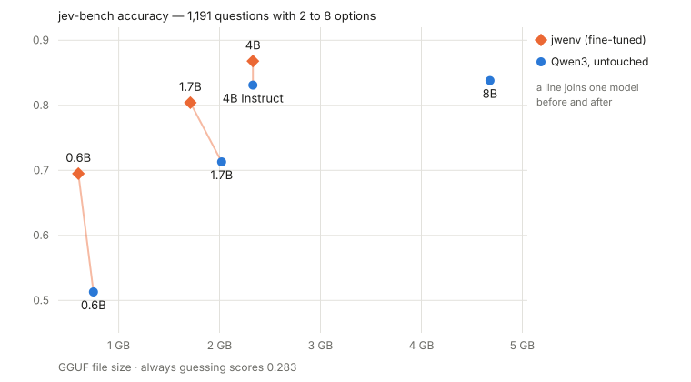

# jwenv-engine

An inference engine for **models that return a probability for each option instead of writing an
answer** — the Jev / TypeSafe System One style of API.

A question with named options becomes one prompt. The prompt is evaluated once and the
probabilities are read straight off the logits of the next token. Nothing is generated, so an answer
costs a single forward pass and the result is a proper distribution you can threshold, rank or route
on.

The engine runs Qwen3 GGUF files on **Node.js + WebGPU**, with no llama.cpp and no native modules.
The same code runs in a browser, where the model file never leaves the machine.

## Quick start — browser only, no server

1. Download a GGUF, for example
   [`qwen3-0.6b-jev-Q8_0.gguf`](https://huggingface.co/kishida/jwenv-0.6b-poc-gguf/resolve/main/qwen3-0.6b-jev-Q8_0.gguf)
   (about 610 MB) from [kishida/jwenv-0.6b-poc-gguf](https://huggingface.co/kishida/jwenv-0.6b-poc-gguf).
2. Serve the demo page — `file://` will not work:

   ```bash
   npm install
   npm run build:web
   npm run serve:web
   ```

3. Open <http://127.0.0.1:8765/> in Chrome or Edge and pick the GGUF you downloaded.

## As an API server

Needs Node.js 24 or later (it runs the TypeScript directly) and a GPU WebGPU can reach — D3D12 on
Windows, Metal on macOS, Vulkan on Linux.

```bash
npm install
npm run build:web                       # only needed for the Web UI
npm start -- --model path/to/model.gguf --port 8080
```

- **API**: `POST http://127.0.0.1:8080/v1/systemone`
- **Web UI**: <http://127.0.0.1:8080/> — the same page, using the server's model
- **Health**: `GET /health` — the loaded model, its temperature, how many requests have been served,
  and KV cache statistics

| option | default | meaning |
|---|---|---|
| `--model` | required | the GGUF to load |
| `--port` / `--host` | 8080 / 127.0.0.1 | where to listen |
| `--api-key KEY` | none | require `Authorization: Bearer KEY` |
| `--weights q8\|f32` | q8 | keep quantized weights on the GPU, or expand to f32 |
| `--temperature T` | the GGUF's own | override the calibration temperature |
| `--kv-cache-tokens` | 8192 | prefix cache shared across requests; 0 disables it |
| `--max-batch-tokens` | 4096 | tokens per forward pass |
| `--max-seq-len` | 2048 | longest sequence |
| `--max-queue` | 256 | queue limit; over it the server answers 529 |

Requests that arrive together are batched into one forward pass. Questions inside one request share
their state, so the state's K/V is computed once and then reused from the prefix cache by later
requests too.

## The API

```bash
curl -s http://127.0.0.1:8080/v1/systemone -H "Content-Type: application/json" -d '{
  "model": "jev-latest",
  "state": "Hi, I have been trying to connect my Stripe account for 3 days and it keeps failing.",
  "questions": {
    "department":  {"type": "choice", "instructions": "Which team should handle this",
                    "criteria": {"billing": "Payment or subscription issues",
                                 "technical": "Bugs or integration problems", "sales": null}},
    "frustration": {"type": "score", "instructions": "How frustrated the customer appears",
                    "criteria": ["Calm, just stating facts", "Frustrated but civil", "Very angry"]},
    "is_urgent":   {"type": "noul", "instructions": "The message conveys urgency"}
  }
}'
```

```json
{
  "model": "qwen3-1.7b-jev-Q8_0",
  "answers": {
    "department":  {"type": "choice", "choice": "technical",
                    "probabilities": {"billing": 0.0599, "technical": 0.9158, "sales": 0.0243},
                    "confidence": 0.6909},
    "frustration": {"type": "score", "score": 1.5271,
                    "legend": {"0": "Calm, just stating facts", "1": "Frustrated but civil",
                               "2": "Very angry"},
                    "probabilities": {"0": 0.0134, "1": 0.4461, "2": 0.5405}, "confidence": 0.317},
    "is_urgent":   {"type": "noul", "noul": 0.9486}
  },
  "usage": {"input_tokens": 275, "output_tokens": 0}
}
```

| `type` | `criteria` | answer |
|---|---|---|
| `noul` | optional, `{"true": "…", "false": "…"}` | `noul`, the probability of true |
| `choice` | `{name: description or null, …}`, 2 to 8 | `choice`, `probabilities`, `confidence` |
| `score` | an array from lowest to highest, 2 to 8 | `score` (the expected level), `probabilities`, `legend`, `confidence` |

- `state` is a string, or any JSON object or array, which is serialized for you.
- `confidence` is `1 − normalized entropy`: 1 when all the mass is on one option, 0 when they are
  indistinguishable.
- Up to 64 questions per request. Questions about the same state share its prompt prefix, so sending
  them together is much cheaper than one request each.
- Errors: `422` for a bad request, with `{"error": {"code", "message", "field"}}`; `401` for the API
  key; `529` when the queue is full.
- Differences from TypeSafe System One: at most 8 options or levels (it allows 255 and 10), and two
  extra options — `{"options": {"temperature_scaling": false, "permutations": 4}}` turns calibration
  off, or averages over rotations of the option order to cancel position bias.

## Models

Any **Qwen3** GGUF works — the architecture has to be `qwen3`, so Qwen3.5 and later, which replace
part of the attention with Gated DeltaNet, are not supported. The probabilities are only meaningful
after calibration; a model fine-tuned for this can carry its temperature in the GGUF metadata key
`jev.temperature`, and the engine then applies it without being told. Whether the prompt ends with
an empty `<think></think>` is read from the model's own chat template, so a thinking model and an
Instruct-2507 model both get the prompt they were trained on.

Supported quantizations: **Q8_0** and the **K-quants** (Q2_K through Q6_K, including the mixed
variants such as Q4_K_M), which stay quantized on the GPU, plus F16 / F32 / BF16, which are expanded
to f32 on load and so need much more GPU memory. IQ quantizations are not supported.

### The jwenv models

Three Qwen3 models fine-tuned for this task, by distilling the probability distribution of a larger
teacher. They answer with A to H, so they handle 2 to 8 options.

| model | base | quant | size | download |
|---|---|---|---|---|
| jwenv 4B poc | Qwen3-4B-Instruct-2507 | Q8_0 | 3.99 GB | [kishida/jwenv-4b-poc-gguf](https://huggingface.co/kishida/jwenv-4b-poc-gguf) |
| | | Q4_K_M | 2.33 GB | |
| jwenv 1.7B poc | Qwen3-1.7B | Q8_0 | 1.71 GB | [kishida/jwenv-1.7b-poc-gguf](https://huggingface.co/kishida/jwenv-1.7b-poc-gguf) |
| | | Q4_K_M | 1.03 GB | |
| jwenv 0.6B poc | Qwen3-0.6B | Q8_0 | 0.60 GB | [kishida/jwenv-0.6b-poc-gguf](https://huggingface.co/kishida/jwenv-0.6b-poc-gguf) |
| | | Q4_K_M | 0.37 GB | |

### What the fine-tuning buys

Measured with [jev-bench](https://github.com/kishida/jev-bench): 1,191 multiple-choice questions
with 2 to 8 options, where always guessing scores 0.283. Each pair below is the same base model
at the same quantization, before and after.



| model | quant | size | accuracy | ECE (T=1 → calibrated) | T | time / question |
|---|---|---|---|---|---|---|
| **jwenv 4B poc** | Q4_K_M | 2.33 GB | **0.868** | 0.067 → **0.023** | 1.52 | 51 ms |
| Qwen3-4B-Instruct-2507 | Q4_K_M | 2.33 GB | 0.831 | 0.096 → 0.043 | 1.77 | 60 ms |
| **jwenv 1.7B poc** | Q8_0 | 1.71 GB | **0.804** | 0.095 → **0.033** | 1.58 | 51 ms |
| Qwen3-1.7B | Q8_0 | 2.02 GB | 0.713 | 0.271 → 0.034 | **8.57** | 55 ms |
| **jwenv 0.6B poc** | Q8_0 | 0.60 GB | **0.695** | 0.125 → **0.043** | 1.60 | 41 ms |
| Qwen3-0.6B | Q8_0 | 0.75 GB | 0.513 | 0.349 → 0.055 | **6.60** | 42 ms |
| Qwen3-8B, for scale | Q4_K_M | 4.68 GB | 0.838 | 0.147 → 0.031 | **7.00** | 71 ms |

The gain is largest where the model is smallest: +0.182 at 0.6B, +0.091 at 1.7B, +0.037 at 4B. A
tuned 0.6B beats an untouched 1.7B, a tuned 1.7B comes close to an untouched 4B Instruct, and the
tuned 4B is still ahead of an untouched 8B at half the size.

The temperature matters as much as the accuracy. An untouched Qwen3 answers almost everything with
near-certainty and needs its logits divided by 6.6 or 8.6 before the numbers mean anything; the
tuned models sit near 1.6, so the raw probabilities are already usable. That is why the uncalibrated
ECE drops from 0.349 to 0.125 at 0.6B.

Those numbers come from llama.cpp — not upstream llama.cpp, which has no such endpoint, but the
`jev` branch of [kishida/llama.cpp](https://github.com/kishida/llama.cpp/blob/jev/docs/jev.md),
where the same `/v1/systemone` is added to `llama-server`. This engine agrees with it — same GGUF,
same questions, same GPU:

| model | accuracy, this engine | accuracy, llama.cpp | time / question, this engine | llama.cpp |
|---|---|---|---|---|
| jwenv 0.6B poc Q8_0 | 0.698 | 0.694 | 84 ms | 43 ms |
| jwenv 1.7B poc Q8_0 | 0.799 | 0.801 | 132 ms | 42 ms |
| jwenv 4B poc Q8_0 | 0.873 | 0.871 | 268 ms | 51 ms |

The answers match to within 0.004, which is two to five questions out of 1,191 — the difference
between two dequantization kernels. llama.cpp is two to five times faster, and the gap widens with
the model, which is what hand-written CUDA against portable WGSL should look like.

### Which one to use

Use the llama.cpp branch if you want **speed**, **images** — it serves any multimodal GGUF with an
`--mmproj`, and the same questions can be asked about a picture — or **any model that is not
Qwen3**: Gemma, GLM, gpt-oss, the Qwen3.5 and later generations, all of them, since it inherits
llama.cpp's model support. Its docs carry a table of how a few dozen models score on this
benchmark.

Use this engine when you want the model to run **in a browser**, with the file never leaving the
machine, or when a native module is not an option. It speaks the same API, so nothing else in your
code changes.

Reproduce it with [jev-bench](https://github.com/kishida/jev-bench):

```bash
npm start -- --model jwenv-4b-poc-q8_0.gguf --port 8080
python jev-bench/eval.py --url http://127.0.0.1:8080
```

## Layout

```text
src/server.ts     the API server and the Web UI it serves
src/jev.ts        the API itself: validation, prompt building, probabilities — shared with the browser
src/model/        Qwen3 forward pass and KV cache
src/gpu/shaders/  the WGSL kernels
src/gguf/         GGUF parsing and dequantization
src/tokenizer/    the BPE tokenizer
web/              the Web UI; `npm run build:web` produces web/dist/
test/             tests and benchmarks
```

Only this directory is needed to run — copy it anywhere.

## Tests

```bash
node test/test_gguf.ts                  # GGUF parsing and Q8_0 dequantization, against gguf-py
node test/test_tokenizer.ts <model.gguf>   # exact agreement with the HF tokenizer
node test/test_kquant.ts <dir>          # K-quant dequantization, against recorded rows
node test/test_batch.ts <model.gguf>    # batching does not change the answer
node test/test_kvcache.ts <model.gguf>  # reusing and sharing KV does not change the answer
node test/bench.ts <model.gguf>         # speed
node test/bench_server.ts http://127.0.0.1:8080
```

Only the first needs nothing but this repository. The tokenizer test reads the vocabulary out of any
Qwen3 GGUF. `test/test_kquant.ts` compares against rows recorded from specific files, named in
`test/fixtures/kquant/cases.json`; point it at the directory holding them, or record new ones from
your own K-quants with `python test/make_kquant_fixture.py <*.gguf>`.

`test/compare_hf.ts` compares the engine layer by layer against a dump from Hugging Face
transformers, which `test/dump_hf.py` produces.

## Licence

Apache-2.0. See [LICENSE](LICENSE).
